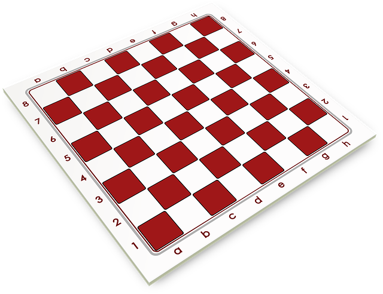

  

# 💻 Projeto
O projeto ainda está em desenvolvimento

### Sistema de Jogo de xadrez em C#
> Este é um projeto de um jogo de xadrez em C# que foi desenvolvido como parte de um estudo sobre os conceitos de programação orientada a objetos. Para demonstrar tópicos essenciais em POO:
* construtores;
* palavra-chave;
* this;
* sobrecarga;
* encapsulamento;
* associações
* herança
* herança
* classe abstrata
* sobreposição
* polimorfismo
* elementos estáticos
* tipos enumerados
* exceções, vetores, matrizes, listas e conjuntos, etc.

## ☕ Visão Geral do Projeto
O projeto é um recurso do curso: 
<a href="https://www.udemy.com/course/programacao-orientada-a-objetos-csharp/" target="_blank">
  C# COMPLETO Programação Orientada a Objetos + Projetos
</a> Criado por <a href="https://www.udemy.com/course/programacao-orientada-a-objetos-csharp/#instructor-1" target="_blank">Nelio Alves</a> Instrutor da Udemy. O projeto é dividido em vários pacotes e classes que representam os componentes do jogo, como tabuleiro, peças, jogadores e movimentos.

 ### 🚀 Etapas e Melhorias

- [x] Iniciando o projeto (13/10/2023)
- [x] Criar classes para representar: (14/10/2023) 
   - tabuleiro;
   - peças;
   - posições e uma aplicação para exibir o tabuleiro na tela.
- [x] Adição de métodos e Exceções personalizadas (15/10/2023)
   - Método InsertPieceChessChesss que permite adicionar peças de xadrez em nosso tabuleiro;
   - Foi criada a exceção personalizada chamada "BoardException", essa exceção  é lançada em caso de erros relacionados ao tabuleiro.
   - Métodos: Verificação de Posição(PositionCheck) e Verificação de Exceções(CheckPosition) 
     - "PositionCheck" verifica se uma posição é válida. Ele verifica se a linha e a coluna estão dentro dos limites do tabuleiro.
     - . "CheckPosition" verifica se uma posição é válida. Esse método lança a exceção BoardException se a posição for inválida.
   - Sobrecarga do Método "Piece": A classe Board agora possui uma sobrecarga do método Piece que permite passar um objeto Position como argumento para obter uma peça.
   - Correção na Classe "ChessPiece": A classe ChessPiece foi atualizada para receber um objeto Board e uma cor como argumentos em seu construtor. Já a posição da peça agora começa como nula (null).
   - Subclasses de Peças de Xadrez (Rei e Torre): Foram criadas duas subclasses, King e Tower, que herdam da classe ChessPiece. Elas representam as peças Rei e Torre, respectivamente.
- [x] Iniciando o sistema de movimentação e inserção de (16/10/2023)
   - Melhorando a documentação interna do código (cometários) para ficar mais legível e autoexplicativo.
   - Adicionado o método "RemovingPiece" que é usado para retirar uma peça do tabuleiro.
   - Adição da nova classe "BoardGame" que representa o jogo de xadrez em si.
   - Passa a lógica de criação do jogo para a class "BoardGame".
   - Criado o método: "Movements" e InsertPieceChess().
- [x] Implementando movimentações possíveis (17/10/2023)
   - Implementando movimentos da torre.
   - Implementando movimentos do rei.
   - Implementação dos movimentos possíveis.
- [x] Refatoração de código: Melhorias nos comentários e nomenclatura: (18/10/2023)
   - Ajuste da nomenclatura de variáveis e métodos.
   - Adição de comentários para melhorar a compreensão do código.
   - Correção de erros e ajustes gerais do código.
   - Adição de novos métodos, como "MakeMove," "MakePlay," "ChangePlayer," "CheckOrigin," e "CheackDestiny," para aprimorar a funcionalidade do jogo de xadrez.
- [x] Melhorias: Novas peças, lógica de Xeque e Xeque Mate, Conjunto de peças em jogo e capturadas, etc...(19/10/2023)
   - Tradução do código para o idioma partuguês.
   - Melhorias nos comentários do código.
   - Correção da lógica e melhoria dos métodos.
   - Implementação de todas as peças do tabuleiro de xadrez.
- [x] Implementação das jogadas especiais 02/11/2023
   - Jogada Especial Roque pequeno e Roque Grande.
## 😄 Execução do projeto

<table>
  <tr>
    <td align="center">
      <a href="https://github.com/codediary-filipe">
         
        
          <b>codediary-filipe</b>
        
      </a>
    </td>
  </tr>
</table>
